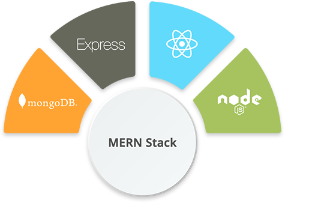

.png)

<h1 align="center">Hello I'am Gary!</h1>

<h3> 👨🏻‍💻 &nbsp;About Me </h3>
  

 I am a creative working in the digital space, I am constantly evolving and improving my skills. My background was originally in finance, and I slowly transitioned into UX&UI design, to further bolster my skill set I became a full stack developer. 
I'm currently designing and building an app and also studying python. 

-------

<h3> 🛠 &nbsp;Tech Stack</h3>

   
  
  

   

 🤝🏻 &nbsp;Connect with Me </h3>

  

<a href="https://www.linkedin.com/in/gary-dineen-325129217/">
  

 

